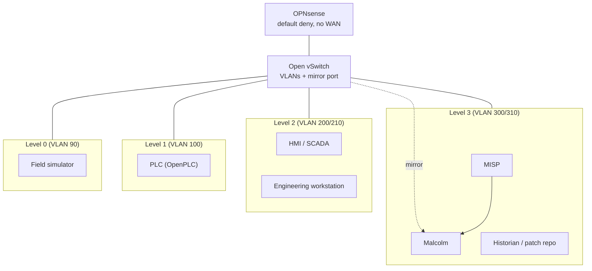
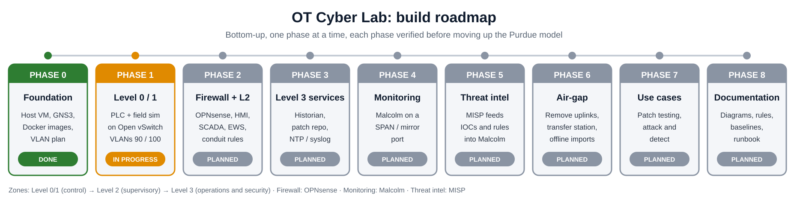

# LAB1: Air-gapped OT Cybersecurity Lab

A proof-of-concept lab, built bottom-up on the **Purdue model (Levels 0-3)**, to safely test
patches, monitor industrial protocols and integrate threat intelligence without touching
production systems. The lab is fully virtual and designed to run with no uplink to any
corporate or production network.

## Goals

- Segment the control system into zones and allow only the flows that are needed.
- Monitor OT traffic with CISA Malcolm (Suricata, Arkime, OpenSearch).
- Feed indicators from MISP into Malcolm.
- Test patches in an isolated sandbox before they get anywhere near production.

## Architecture



- Addressing and VLANs: [docs/ip-vlan-plan.md](docs/ip-vlan-plan.md)
- Firewall conduits (default deny): [docs/firewall-rules.md](docs/firewall-rules.md)

## Stack

| Role | Tool |
|---|---|
| Host | One Linux VM (Ubuntu) on VMware, nested virtualization |
| Network emulation | GNS3 |
| Switch | Open vSwitch (VLANs, port mirroring) |
| Firewall | OPNsense |
| PLC | OpenPLC runtime (Docker) |
| Field devices | Python Modbus/TCP simulator (Docker) |
| Monitoring | CISA Malcolm |
| Threat intelligence | MISP |

## Roadmap




| Phase | Scope | Status |
|---|---|---|
| 0 | Host, tools, images, documentation | Done |
| 1 | Level 0/1: PLC and field simulator on the switch | Done |
| 2 | OPNsense firewall and Level 2 (HMI, SCADA, EWS) | In progress |
| 3 | Level 3 services (historian, patch repo, NTP/syslog) | Planned |
| 4 | Malcolm traffic monitoring | Planned |
| 5 | MISP and threat-intel integration | Planned |
| 6 | Air-gap hardening and transfer station | Planned |
| 7 | Use cases: patch testing, attack and detect | Planned |
| 8 | Final documentation | Planned |

## Repository layout

LAB1/
├── docker-compose.yml # image build recipe and quick smoke test
├── images/ # field-sim, openplc, ews Dockerfiles
└── docs/ # IP/VLAN plan, firewall rules, switch scripts

## Quick start

```bash
docker compose build        # builds the lab images
docker compose up -d        # optional smoke test of the L0/L1 containers
docker compose exec ews curl -sI http://10.250.10.11:8080 | head -1
docker compose down
```

The full topology (switch, firewall, VLANs) is wired in GNS3 using these images. Don't run
`docker compose up` alongside it, because GNS3 links replace the compose networks. Change
the default OpenPLC password after the first login.

## Lessons learned

- Docker builds behind a filtered network can fail on `apt`. Building with
  `network: host` fixed it here.
- Nested virtualization must be enabled on the VM before an OPNsense VM can use KVM.
- A Docker bridge is a plain virtual switch with no VLANs, which is why the final design
  uses Open vSwitch for real VLAN trunks and a mirror port.

- Two copies of the lab (Compose smoke test and GNS3) shared the same addresses; the switch counters staying flat exposed it. See [docs/troubleshooting.md](docs/troubleshooting.md).

## Safety

Run this lab only in an isolated environment. It contains intentionally simple, unhardened
components and must never be connected to production or corporate networks.
