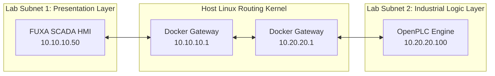

# Distributed OT Laboratory Sandbox: FUXA SCADA HMI Node

This repository houses the configuration code, customized container deployment layers, and network routing boundaries for the **FUXA SCADA Operator Interface** node. It serves as an isolated Presentation and Monitoring Layer (Purdue Model Level 2) within a distributed multi-subnet industrial simulation sandbox.

---

## Deep Dive: Why Containerization Was Chosen for This Node

When architecting this laboratory playground on a local engineering host, a deliberate design choice was made to leverage **Docker Containerization** rather than traditional hardware **Virtual Machines (VMs)** for the application layers. 

### 1. Architectural and Resource Efficiency Trade-offs
Traditional hypervisors require a completely separate guest operating system kernel for every single application deployed, adding severe compute overhead. Containers share the host operating system's kernel, providing microscopic footprints:

| Architectural Metric | Docker Containers (Current Selection) | Virtual Machines  (Hypervisor Alternative) |
| :--- | :--- | :--- |
| **RAM Footprint** | **Minimal:** Under `250 MB` allocation total for runtime operation. | **Heavy:** Requires a base allocation of `2 GB – 4 GB` for the guest OS. |
| **Storage Allocation**| **Compact:** Under `400 MB` utilizing minimal base layers (`node:18-alpine`). | **Bloated:** Consumes `10 GB – 20 GB` for disk installation files. |
| **Provisioning Speed**| **Instantaneous:** Spins up or completely breaks down in under **3 seconds**. | **Sluggish:** Requires minutes to execute bios emulation and OS boots. |
| **Portability Lifecycle**| **Immutable:** Built via code instructions; identical across home and work systems. | **Variable:** Prone to host configuration drifts and snapshot breakages. |

### 2. DevOps Pipeline Portability (Home Dev to Work Production)
This container-centric architecture mirrors modern industrial **DevOps Infrastructure-as-Code (IaC)** workflows. By wrapping FUXA in a container:
* **The Environment is Portable:** The layout can be coded, simulated, and tested seamlessly on a home desktop .
* **Frictionless Migration:** Pushing this repository to GitHub allows a matching copy to be pulled down and run immediately on a production server host without modifying code or encountering local software library errors.
---

## 🌐 Network Zoning & Topology

This node is completely isolated from the industrial logic execution layer (OpenPLC) to simulate correct industrial defense strategies. Network boundaries are enforced by pinning the HMI into a distinct virtual software bridge interface.

* **Assigned Subnet Zone:** `10.10.10.0/24`
* **Static HMI IP Address:** `10.10.10.50`
* **Virtual Subnet Gateway:** `10.10.10.1`



---

## Execution & Quickstart Provisioning

1. **Clone the Folder and Navigate:**
   ```bash
   cd lab-scada-fuxa
   ```
2. **Build and Spin Up the Local Stack:**
   The following single wrapper command reads the local `Dockerfile` layout to assemble dependencies and maps out your virtual ethernet bridge adapter network:
   ```bash
   sudo docker compose up -d --build
   ```
3. **Verify Runtime Isolation Integrity:**
   ```bash
   sudo docker ps -a
   ```
---

## Industrial Driver Mapping & Telemetry Configuration

To build communication pathways from this node out to remote assets across the host routing bridge, follow this explicit mapping matrix inside the FUXA workspace studio environment:

### 1. Channel Driver Ingestion
* **Navigation Path:** Launch `http://localhost:1881` -> Open workspace **Editor** grid canvas -> Select the **Gear Icon** -> Click **Connections** -> Select **Add (+)**.
* **Target Address Parameter:** Set Destination Endpoint IP to **`10.20.20.100`** over destination service listening port **`502`**.
* **Protocol Choice:** `Modbus-TCP`

### 2. Transaction Controls & Advanced Parameter Overrides
* **Slave ID (Unit Identifier):** Set explicitly to **`1`** to synchronize with OpenPLC internal holding registers.
* **Polling Enable:** Checked/True to initiate continuous register scanning.
* **Socket Reuse:** Checked/True to prevent local OS TCP socket lockouts during runtime container initialization cycles.
* **Connection Timeout:** Set to **`2000 ms`** to guarantee fast state teardowns and socket reconnections if processing delays occur.

### 3. Telemetry Register Indexing
When defining interactive variables inside the **Connections -> Tags** template window properties form, configure them as follows:

| Property | Value Setting | Structural Defense Purpose |
| :--- | :--- | :--- |
| **Device** | `OpenPLC_Core` | Hooks the variable to our verified Modbus-TCP connection bridge. |
| **Tagname** | `Lab_Test_Register` | Identifiable nomenclature for drag-and-drop workspace component bindings. |
| **Register Type** | `Holding Register` | Triggers Modbus Function Code 03 (Read) and 16 (Write Multiple). |
| **Address / Offset**| `0` | Points straight to the baseline `%QW0` memory register block inside OpenPLC. |
| **Type (Format)** | **`Int32`** | **Forces Write Multiple Registers (FC16 / 0x10)** by spanning adjacent registers. |
| **Divisor** | `1` | Retains raw integer alignment during database parsing. |

---

## Host Diagnostics & Traffic Interception Runbook

Because the optimized base image is stripped of basic diagnostic troubleshooting binaries like `ping`, perform evaluations directly from your Linux host terminal shell:

1. **Verify Interface Availability:**
   ```bash
   ping -c 3 10.10.10.50
   ```
2. **Sniff Modbus Transaction Payloads:**
   To verify that FUXA is actively using **Write Multiple Registers (FC16)** payload signatures, trace network transactions on your host machine:
   ```bash
   sudo tcpdump -i any -v -nn port 502
   ```
   *Look for the hex flag indicator **`0x10`** stamped inside the packet metadata to confirm successful operational telemetry writes.*

